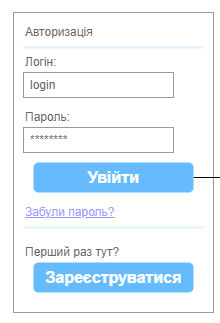
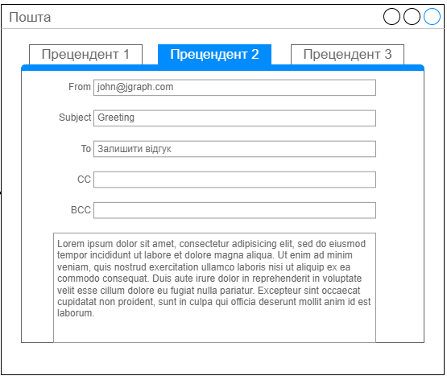

|NFR id|Test Case id|Опис кроків тестового сценарію|Опис очікуваних результатів|
|:-:|:-:|:-|:-:|
|NFR1.1|TC1.6|Початкові умови: відсутні.   Кроки сценарію: відсутні.|Екрана форма:   
|NFR1.1|TC1.7|Початкові умови: успішно пройдено TC1.6.   Кроки сценарію:   1) В поле «Логін» внесен логін існуючого користувача   2) В поле «Пароль» внесен пароль до відповідного логіну   3) Натиснута кнопка «Увійти»|Екрана форма:   
